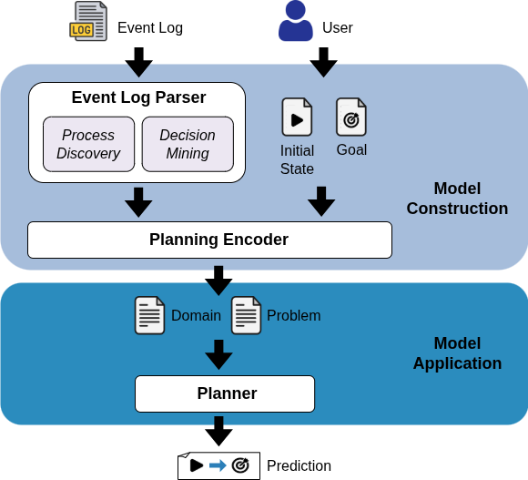

# Predictive Process Monitoring via Automated Planning 
Source code, event log presented in the case study, and instructions for using the framework presented in the paper "[Predictive Process Monitoring via Automated Planning](https://link.springer.com/chapter/10.1007/978-3-032-27997-2_16)".

## About
Predictive Process Monitoring (PPM) forecasts the future behavior of ongoing business process executions to support proactive decision-making.
Although state-of-the-art deep learning approaches achieve high predictive accuracy, they often act as black boxes, without explaining the execution steps that lead to a given outcome, thus limiting their applicability in scenarios requiring transparent what-if analysis.

In this paper, we propose a planning-based framework for \textit{situation prediction}, which anticipates not only whether a specific outcome is achievable but also the exact sequence of activities and data updates required to reach it. We introduce an automated pipeline that transforms event logs into PDDL planning tasks by combining process discovery with decision mining, allowing classical planners to generate compliant, goal-oriented predictions. Experiments on real-world logs show that our framework provides high solvability and predictive performance while offering transparency.


## Structure of the repository

```
└── xes2plan/
    ├── README.md
    ├── LICENSE
    ├── evaluation/
    │   ├── README.md
    │   └── batch_results/                   # output directory for batch evaluations
    ├── figures/
    │   └── framework.png
    ├── logs/                                # folder containing event logs in XES format
    │   ├── bpic_2012_a.xes
    │   ├── bpic_2012_o.xes
    │   ├── bpic_2012_w.xes
    │   ├── bpic_2012_wc.xes
    │   ├── bpic_2012.xes
    │   ├── bpic_2013_cp.xes
    │   ├── bpic_2013_i.xes
    │   ├── bpic_2017.xes
    │   ├── env_permit.xes
    │   ├── helpdesk.xes
    │   └── sepsis.xes                       # main case study log
    ├── pddl/                                # folder containing the resulting encoding of the log in the PDDL domain and problem files
    │   ├── domain.pddl
    │   ├── problem.pddl
    │   └── input/
    │       ├── goal.pddl
    │       └── init.pddl
    └── src/                                 # source code for the parsing and encoding of the XES log into a PDDL specification
        ├── analyze_results.py               # results analysis and visualization
        ├── batch_evaluation.py              # batch evaluation system
        ├── call_planner.py                  # script to handle Fast-Downward invocations
        ├── eval_outcome_prediction.py       # outcome prediction evaluation module
        ├── eval_planning.py                 # planning evaluation module
        ├── eval_suffix_prediction.py        # suffix prediction evaluation module
        ├── main.py
        ├── pddl_encoder.py
        ├── xes_parser.py
        ├── downward/                        # Fast-Downward planner (git submodule)
      └── ...
```

## Getting Started

First, download the repository locally on your machine and navigate into the main folder.

```bash
git clone --recurse-submodules https://github.com/angelo-casciani/xes2pddl
cd xes2pddl
```

Assuming a working version of Python (v.3.10.12) installed on the machine, create a virtual environment in the root folder of the project.

```bash
python3 -m venv .venv
source .venv/bin/activate
```

Run the following command to install the necessary packages along with their dependencies in the `requirements.txt` file using `pip`:

```bash
pip install -r requirements.txt
```

The event logs in the `logs/` folder are compressed. Unzip them before proceeding.

### Setup for Planners

This project uses PDDL planners as Git submodules:
- [Fast-Downward](https://www.fast-downward.org/) - Classical PDDL planner

#### Prerequisites

**For Fast Downward:**
- CMake
  - Ubuntu/Debian: `sudo apt install cmake`
  - macOS: `brew install cmake`

**Important:** Install Fast Downward dependencies **before** running the setup script.

#### Build Planners

Run the setup script to initialize git submodules and build the planners.

```bash
# Setup Fast Downward
./setup_submodules.sh

# Setup only Fast Downward
./setup_submodules.sh --only-fast-downward

# Show help
./setup_submodules.sh --help
```

## Usage

Run the framework:
```bash
cd src
python3 main.py
```

The complete encoding comprehensive of the PDDL domain and problem will be stored in two `.pddl` files in the [pddl](pddl) folder.

The default parameters are: 
- Log Coverage (minimum cumulative coverage percentage for variant filtering): `0.003`;
- XES event log to encode in PDDL: `'sepsis.xes'`;
- Name of the PDDL domain to generate: `'xes_log'`;
- Path to the file containing initial state predicates: `'../pddl/input/init.pddl'`;
- Path to the file containing goal conditions: `'../pddl/input/goal.pddl'`;
- Discovery algorithm for Petri net discovery: `'alpha'`;

To customize these settings, modify the corresponding arguments when executing `main.py`:
- Use `--log_coverage` to specify a different minimum cumulative coverage percentage for variant filtering.
- Use `--xes_name` to specify a different XES event log to encode in PDDL (the corresponding XES log must be contained in the [logs](logs) folder);
- Use `--pddl_name` to specify a different name of the PDDL domain to generate;
- Use `--init` to specify a different path to the file containing initial state predicates;
- Use `--goal` to specify a different path to the file containing goal conditions;
- Use `--discovery_algorithm` to specify the discovery algorithm for Petri net discovery (options: `alpha`, `inductive`, `heuristics`, `ilp`).

To specify different conditions on the predicates in the initial state and in the goal state, change the content of the corresponding files in the [input](input) folder.
Each line in these files should contain a single PDDL predicate representing a condition for the initial or goal state, respectively. For example, an `init.pddl` file might look like:
```bash
(enabled some_starting_activity)
(attribute1 value_a)
(not (attribute2))
```
Note that the start activity is always enabled to always allow the generation of a plan.

And a `goal.pddl` file:
```bash
(completed some_end_activity)
(attribute3 value_b)
```

Once the translation is complete, we can use Fast Downward to generate a plan.

### Using Fast Downward (Classical Planning)

Once the planner is configured, we can use it to generate a plan (prediction). For example, using Fast-Downward set up as reported above, we can run the following command (assuming the previously generated PDDL domain and problem files are in a folder accessible by the planner) to generate a prediction leveraging A* with LM-cut heuristic:
```bash
cd src/downward
./fast-downward.py ../../pddl/domain.pddl ../../pddl/problem.pddl --search "astar(lmcut())"
```

For the case study presented in the paper, the resulting plan (prediction) for the specified initial state and goal is as follows:
```bash
(er_registration)
(er_triage)
(leucocytes)
(crp)
```

## Discovery Algorithms

The framework supports four different discovery algorithms for Petri net discovery from event logs:
1. *Alpha Miner (`alpha`)*;
2. *Inductive Miner (`inductive`)*;
3. *Heuristics Miner (`heuristics`)*;
4. *ILP Miner (`ilp`)*.
  
### Usage Examples

Use different discovery algorithms by specifying the `--discovery_algorithm` parameter:

```bash
# Use Alpha Miner for simple logs
python3 main.py --discovery_algorithm alpha

# Use Inductive Miner for noisy logs (default)
python3 main.py --discovery_algorithm inductive --xes_name helpdesk.xes

# Use Heuristics Miner for complex control flow
python3 main.py --discovery_algorithm heuristics --xes_name bpic_2017.xes

# Use ILP Miner for optimal results
python3 main.py --discovery_algorithm ilp --log_coverage 0.01
```

## Evaluation

The framework provides three types of evaluation to assess the effectiveness of the XES2PDDL approach:

1. **Planning evaluation** - Tests the technical feasibility of generating valid plans
2. **Suffix prediction evaluation** - Measures accuracy of activity sequence predictions  
3. **Outcome prediction evaluation** - Assesses numerical outcome prediction capabilities

### 1. Planning Evaluation

Planning evaluation assesses the ability of PDDL planners to generate valid plans from the encoded process models. This evaluation:

- **Tests planner performance** across different search algorithms and heuristics
- **Measures planning time** and solution quality  
- **Validates plan feasibility** by checking if generated plans achieve the specified goals
- **Analyzes scalability** with different log coverage levels

To run a single planning evaluation:
```bash
cd src
python3 eval_planning.py
```

### 2. Suffix Prediction Evaluation

Suffix prediction evaluation measures how well the planning-based approach predicts future process behavior compared to actual trace suffixes. This evaluation:

- **Compares predicted activity sequences** with actual suffixes from historical data
- **Uses Damerau-Levenshtein distance** to measure similarity between predicted and actual sequences
- **Analyzes prediction accuracy** across different process prefixes
- **Evaluates transparency** of predictions by providing explicit activity sequences

To run suffix prediction evaluation:
```bash
cd src
python3 eval_suffix_prediction.py
```

### 3. Outcome Prediction Evaluation

Outcome prediction evaluation assesses the framework's ability to predict outcomes (e.g., medical test results, performance metrics) based on process execution context. This evaluation:

- **Predicts discretized numerical values** of target attributes using planning-based approach
- **Compares predicted outcomes** with actual attribute values from completed traces
- **Evaluates multiple target attributes** simultaneously or focuses on specific numerical attributes
- **Measures prediction accuracy** across different discretization levels (low, medium, high, etc.)
- **Provides transparent explanations** by showing which activities lead to specific outcomes

This type of evaluation is particularly valuable in healthcare and other domains where understanding the causal relationship between process activities and numerical outcomes is critical for decision-making.

To run outcome prediction evaluation:
```bash
cd src
python3 eval_outcome_prediction.py
```

#### Outcome Evaluation Parameters

You can customize the outcome evaluation with the following parameters:

- `--target_attribute`: Specify a particular numerical attribute to predict (e.g., "leucocytes", "cRP", "lacticAcid", "age"). If not specified, all numerical attributes will be evaluated
- `--xes_name`: Event log to use (default: "sepsis.xes")
- `--search`: Planning algorithm (default: "astar_lmcut")
- `--log_coverage`: Minimum coverage for variant filtering (default: 0.00001)

Example for predicting leucocytes values in sepsis cases:
```bash
python3 eval_outcome_prediction.py --target_attribute leucocytes --xes_name sepsis.xes --search astar_lmcut --log_coverage 0.01
```

Example for predicting CRP levels:
```bash
python3 eval_outcome_prediction.py --target_attribute cRP --xes_name sepsis.xes --search lazy_greedy_ff --log_coverage 0.001
```

Example using different discovery algorithms:
```bash
python3 eval_outcome_prediction.py --target_attribute leucocytes --discovery_algorithm inductive --xes_name sepsis.xes

python3 eval_planning.py --discovery_algorithm heuristics --xes_name bpic_2017.xes --search astar_lmcut

python3 eval_suffix_prediction.py --discovery_algorithm ilp --xes_name helpdesk.xes --log_coverage 0.01
```

The results will be stored in a `.csv` file reporting all the information for the run in the [evaluation](evaluation) folder.

#### Outcome Evaluation Results

The outcome evaluation generates detailed CSV reports with the following information for each prediction:

- **Full Real Trace**: The complete actual trace from the event log
- **Prefix Length**: Length of the prefix used for prediction
- **Target Attribute**: The numerical attribute being predicted (e.g., leucocytes, cRP)
- **Actual Value**: The real numerical value from the completed trace
- **Actual Discretized**: The discretized version of the actual value (low, medium, high, etc.)
- **Planning Success**: Whether the planner found a valid plan
- **Predicted Discretized**: The predicted discretized value from the planning approach
- **Search Algorithm**: The planning algorithm used for prediction

This enables comprehensive analysis of:
- **Prediction accuracy** across different attribute discretization levels
- **Planning success rates** for different process contexts
- **Comparison between predicted and actual outcomes** for transparency analysis

### 4. Batch Evaluation

For comprehensive evaluation across multiple configurations, the framework includes a batch evaluation script that automates testing with different combinations of:

- **Event logs**: Various XES files from different domains
- **Search algorithms**: Multiple PDDL planning algorithms and heuristics  
- **Discovery algorithms**: Different Petri net discovery algorithms (alpha, inductive, heuristics, ilp)
- **Log coverage**: Different minimum cumulative coverage percentages for variant filtering
- **Evaluation types**: Planning, suffix prediction, and outcome prediction evaluations

#### Quick Start with Batch Evaluation

**Quick test run (16 evaluations):**
```bash
cd src
python3 batch_evaluation.py --preset single_log
```

**Full comprehensive evaluation (990 evaluations):**
```bash
cd src
python3 batch_evaluation.py --preset full
```

**Outcome prediction evaluation only:**
```bash
cd src
python3 batch_evaluation.py --preset outcome --output ../evaluation/outcome_results
```

**Quick test including all evaluation types:**
```bash
cd src
python3 batch_evaluation.py --preset single_log --output ../evaluation/comprehensive_test
```

#### Available Predefined Configurations

- **`quick`**: Fast test with 2 logs, 2 algorithms, 2 coverage levels
- **`full`**: Comprehensive test with all logs, algorithms, and discovery methods
- **`planning_only`**: Focus on planning evaluation only
- **`suffix_only`**: Focus on suffix prediction evaluation only
- **`outcome_only`**: Focus on outcome prediction evaluation only
- **`single_log`**: Comprehensive test on sepsis.xes only
- **`algorithms_comparison`**: Compare all search algorithms on sepsis.xes
- **`coverage_analysis`**: Analyze different coverage levels
- **`quick_with_outcome`**: Fast test including all three evaluation types
- **`outcome_analysis`**: Focused outcome prediction analysis on sepsis.xes
- **`discovery_comparison`**: Compare all discovery algorithms on sepsis and helpdesk logs

To see all available presets:
```bash
python3 batch_evaluation.py --list-presets
```

#### Discovery Algorithm Comparison

To specifically compare different discovery algorithms:
```bash
cd src
python3 batch_evaluation.py --preset discovery_comparison --output ../evaluation/discovery_results
```

This preset tests all four discovery algorithms (alpha, inductive, heuristics, ilp) on sepsis.xes and helpdesk.xes with both planning and suffix prediction evaluations.

#### Available Search Algorithms

The batch evaluation system supports multiple PDDL planning algorithms:

- **`astar_lmcut`**: A* with LM-Cut heuristic (recommended)
- **`astar_hmax`**: A* with h^max heuristic
- **`astar_ipdb`**: A* with iPDB heuristic
- **`lazy_greedy_ff`**: Lazy greedy with FF heuristic
- **`lazy_wastar_ff`**: Lazy weighted A* with FF heuristic
- **`eager_greedy_ff_cg`**: Eager greedy FF heuristic with causal graph
- **`ehc_ff`**: Enforced hill-climbing with FF heuristic
- **`lazy_greedy_cea`**: Lazy greedy with CEA heuristic
- **`lazy_greedy_goalcount`**: Lazy greedy with goal count

#### Log Coverage Levels

Control the complexity of the encoded model by selecting different minimum coverage percentages. The filter keeps the most frequent trace variants until their cumulative frequency reaches or exceeds the specified percentage:

- **`0.0001`**: Keep only the most frequent variants covering at least 0.01% of cases (simplest model)
- **`0.001`**: Keep variants covering at least 0.1% of cases cumulatively
- **`0.01`**: Keep variants covering at least 1% of cases cumulatively  
- **`0.1`**: Keep variants covering at least 10% of cases cumulatively
- **`0.5`**: Keep variants covering at least 50% of cases cumulatively
- **`1.0`**: All variants (most complex model - 100% coverage)

#### Results Analysis

After running batch evaluations, analyze results with the built-in analysis tool:

```bash
cd src
python3 analyze_results.py ../evaluation/batch_results
```

This generates:
- **Console output**: Success rates and performance statistics
- **Visualizations**: Success rate charts, duration distributions, heatmaps
- **Comprehensive report**: Detailed analysis of all evaluations

#### Example Custom Configuration

Create a JSON configuration file for targeted evaluation:

```json
{
  "event_logs": ["sepsis.xes", "helpdesk.xes"],
  "search_algorithms": ["astar_lmcut", "lazy_greedy_ff"],
  "log_coverages": [0.001, 0.01],
  "evaluations": ["planning", "suffix_prediction", "outcome_prediction"],
  "timeout": 300
}
```

#### Output Structure

Each batch run creates a structured output directory:
```
evaluation/batch_results/
├── batch_summary.csv           # Summary of all runs
├── complete_results.json       # Detailed results
└── individual_runs/
    ├── planning_sepsis_astar_lmcut_cov0.001_[timestamp]/
    │   ├── config.json          # Configuration for this run
    │   ├── result.json          # Results and metrics
    │   ├── stdout.txt           # Standard output
    │   └── stderr.txt           # Error output
    └── ...
```

## Citation

If you use this repository in your research, please cite:

```bibtex

@inproceedings{casciani2026predictive,
  title = {Predictive Process Monitoring via Automated Planning},
  author={Casciani, Angelo and Giovannetti, Alessandra and Macagnano, Silvia and Marrella, Andrea and Bernardi, Mario Luca and Cimitile, Marta and Maggi, Fabrizio Maria},
  booktitle = {Intelligent Information Systems - 38th International Conference, CAiSE 2026 Forum and Doctoral Consortium, Verona, Italy, June 8–12, 2026, Proceedings},
  series = {Lecture Notes in Business Information Processing},
  volume = {587},
  pages={135--145},
  doi = {https://doi.org/10.1007/978-3-032-27997-2_16},
  url = {https://link.springer.com/chapter/10.1007/978-3-032-27997-2_16},
  year = {2026},
  publisher = {Springer}
}
```

## License
Distributed under the GNU GPL License. See [LICENSE](LICENSE) for more information.
